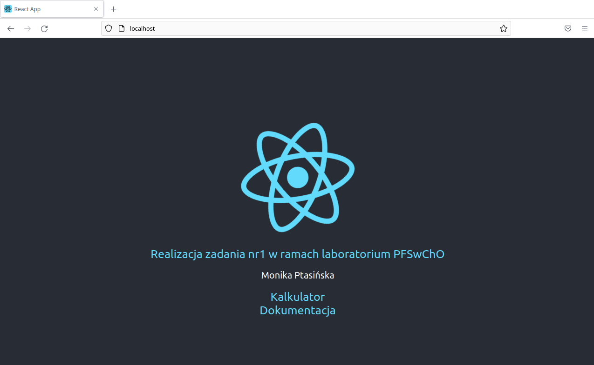

# Zadanie 1

## Aplikacja bazuje na przykładzie z lab. 9.

## Zmodyfikowano:
### server:
* **index.js** - zmieniono limit dla indeksu k do 20

### client:
* **Fib.js** - zmodyfikowano funkcję render (wyświetlanie historii)
* **App.js** - wykorzystano router React

* #### **Dodano elementy:**
    * **Home.js** - komponent strony głównej
    * **Documentation.js** - komponent dokumentacji

### worker:
* **index.js** - poprawiono funkcję obliczającą k-ty wyraz ciągu

## Uruchomienie
W katalogu głównym repozytorium wykonać polecenie:

`COMPOSE_DOCKER_CLI_BUILD=1 DOCKER_BUILDKIT=1 docker compose -f docker-compose.dev.yml up --build`

Aplikacja działa na porcie 80

## Zrzut ekranu

